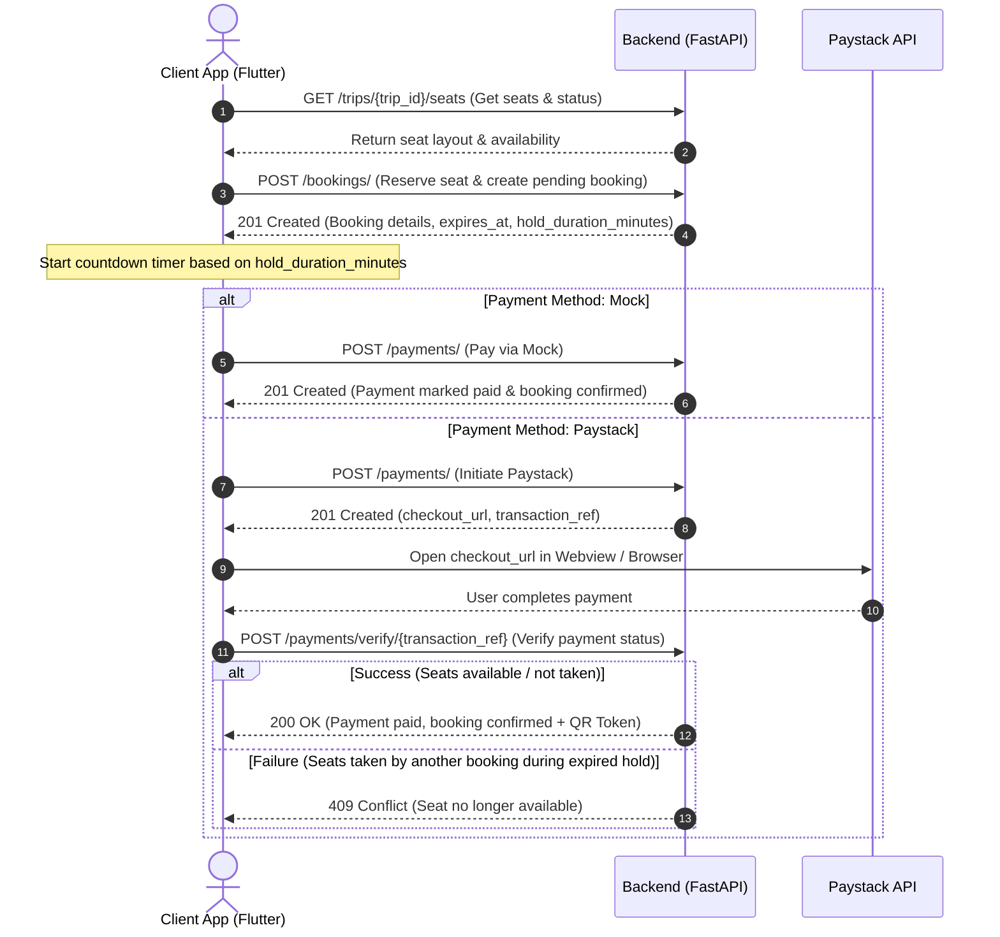

# Flutter Booking Integration Guide

This guide details the complete, end-to-end integration flow for the booking and payment process in the Flutter application. It aligns with the backend's dynamic hold duration logic and the "first to verify payment gets the seat" policy.

---

## Complete Booking & Payment Flow Diagram



---

## Step-by-Step Implementation

### Step 1: Query Trip Seat Layout
Before booking, fetch the list of seats to display the seat grid.

* **Endpoint**: `GET /trips/{trip_id}/seats`
* **Response**: List of seats with their statuses:
  ```json
  [
    {
      "id": "e67406a6-8be7-4a0d-9b7e-97eb70b20536",
      "trip_id": "7ac237e1-8f5b-439f-a827-024522d05ccb",
      "seat_number": "1A",
      "status": "available",
      "reserved_until": null
    },
    {
      "id": "dbf2479e-d31e-450f-ad72-132d20e7df5d",
      "trip_id": "7ac237e1-8f5b-439f-a827-024522d05ccb",
      "seat_number": "1B",
      "status": "reserved",
      "reserved_until": "2026-06-15T13:06:41Z"
    }
  ]
  ```
* **Flutter UI Guidance**: 
  - Grey out `booked` seats.
  - Check if `status` is `reserved` and `reserved_until` is in the future. If yes, grey them out as well.
  - If a seat is `reserved` but `reserved_until` is in the past, treat it as **available** (the backend does this lazily).

---

### Step 2: Create a Seat Reservation (Hold)
When the user selects seats and clicks "Reserve", call the create booking endpoint.

* **Endpoint**: `POST /bookings/`
* **Request Header**: `Authorization: Bearer <token>`
* **Request Body**:
  ```json
  {
    "trip_id": "7ac237e1-8f5b-439f-a827-024522d05ccb",
    "seats": [
      {
        "seat_id": "e67406a6-8be7-4a0d-9b7e-97eb70b20536",
        "gender": "male",
        "has_luggage": true,
        "luggage_type": "backpack"
      }
    ],
    "family_package": false
  }
  ```
* **Response (201 Created)**:
  ```json
  {
    "id": "a90dfbd8-12cd-4389-8d70-c08170c1e847",
    "client_id": "c19b02a9-7fa1-419b-ae7d-e6b7852c024d",
    "trip_id": "7ac237e1-8f5b-439f-a827-024522d05ccb",
    "status": "pending",
    "total_fare": 25.00,
    "hold_duration_minutes": 30,
    "expires_at": "2026-06-15T13:06:41Z",
    "created_at": "2026-06-15T12:36:41Z"
  }
  ```

* **Flutter Hold/Countdown Logic**:
  - The hold duration is dynamically calculated by the backend:
    - Trip departs in **>= 4 days** &rarr; **24 hours** hold
    - Trip departs in **1 to 3 days** &rarr; **30 minutes** hold
    - Trip departs in **< 24 hours** &rarr; **15 minutes** hold
  - Store the `expires_at` timestamp.
  - Start a countdown timer in your Flutter UI showing minutes and seconds remaining (e.g., using `Timer.periodic`).
  - Warn the user that they must complete payment before the timer reaches `0:00`.

---

### Paystack Sandbox Credentials
Use these keys for testing the integration:
* **Test Public Key (Flutter App)**: `pk_test_d7ff80abce295bf7e23135cb4854b5b702c8550e`
* **Test Secret Key (Backend API)**: `sk_test_6d38eb5af09f483f5de9caaa4e8b3b70e515e61d`

---

### Step 3: Initiate Payment
Call the payment initiation endpoint.

* **Endpoint**: `POST /payments/`
* **Request Body**:
  ```json
  {
    "booking_id": "a90dfbd8-12cd-4389-8d70-c08170c1e847",
    "method": "paystack" // Options: "paystack", "cash", "mock"
  }
  ```

#### Flow A: Paystack (Real/Interactive)
* **Response (201 Created)**:
  ```json
  {
    "id": "e5513d8d-cb2a-4a2a-be69-923f03b2241d",
    "booking_id": "a90dfbd8-12cd-4389-8d70-c08170c1e847",
    "amount": 25.00,
    "method": "paystack",
    "status": "pending",
    "transaction_ref": "b96053ea-202e-4b47-ad34-63309a473a21",
    "checkout_url": "https://checkout.paystack.com/checkout/placeholder?ref=b96053ea-202e-4b47-ad34-63309a473a21"
  }
  ```

* **Flutter WebView Integration & Navigation Interception**:
  1. Extract the `checkout_url`.
  2. Open a standard Flutter WebView page (using `webview_flutter` or `flutter_inappwebview`).
  3. Listen to navigation requests inside the WebView. Paystack redirects the user's browser after successful checkout or cancellation:
     - On successful card verification, Paystack will show a success page.
     - On cancellation or redirect back, the URL changes.
  4. **Secure In-App WebView Interception**:
     Use `NavigationDelegate` to check URL patterns:
     ```dart
     NavigationDelegate(
       onNavigationRequest: (NavigationRequest request) {
         // Intercept when Paystack signals payment completion or standard callback redirect
         if (request.url.contains('paystack.co/close') || 
             request.url.contains('callback') || 
             request.url.contains('success')) {
           
           // Close the WebView screen and trigger secure backend verification
           Navigator.of(context).pop();
           verifyPaymentOnBackend(transactionRef);
           return NavigationDecision.prevent;
         }
         return NavigationDecision.navigate;
       },
     )
     ```
  5. Also handle the case where the user manually closes/backs out of the WebView page (using Flutter's `PopScope` or back button). When they dismiss the WebView, **always trigger the verification API call** to check if they completed payment before dismissing.

#### Flow B: Mock Payment (Testing)
* **Response (201 Created)**:
  - Immediately verifies payment and confirms booking.
  - No WebView or callback verification is needed.

---

### Step 4: Verify Payment & Handle Seat Conflicts
Once the user completes or closes the Paystack WebView flow, the Flutter app **MUST** verify the payment by calling the backend endpoint. The backend will securely verify the reference directly with Paystack's server.

* **Endpoint**: `POST /payments/verify/{transaction_ref}`
* **Headers**: `Authorization: Bearer <token>`
* **HTTP Status Codes to Handle**:

#### Case 4.1: Success (Booking Confirmed)
* **Status**: `200 OK`
* **Response**:
  ```json
  {
    "id": "e5513d8d-cb2a-4a2a-be69-923f03b2241d",
    "booking_id": "a90dfbd8-12cd-4389-8d70-c08170c1e847",
    "amount": 25.00,
    "method": "paystack",
    "status": "paid",
    "transaction_ref": "b96053ea-202e-4b47-ad34-63309a473a21"
  }
  ```
  *Fetch the booking details afterwards via `GET /bookings/{booking_id}` to retrieve the confirmed ticket with its `qr_image_base64`.*

#### Case 4.2: Conflict (Booking expired and seat stolen)
If the user paid *after* the hold countdown expired, and another customer reserved or booked the exact same seat in the meantime, the backend verification will fail.
* **Status**: `409 Conflict`
* **Response**:
  ```json
  {
    "detail": "Seat 1A is no longer available (already booked or reserved by another user)."
  }
  ```
* **Flutter Error Handling UI Strategy**:
  - Display a clean error sheet/dialog: **"Reservation Expired: Your seats were booked by someone else during checkout."**
  - Inform the user that they will receive an automatic refund or can contact customer support with their transaction reference (`transaction_ref`).
  - Provide a button to return to the search/trips list.

